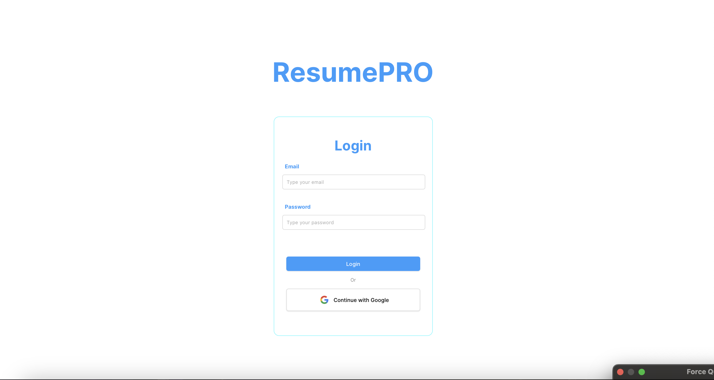
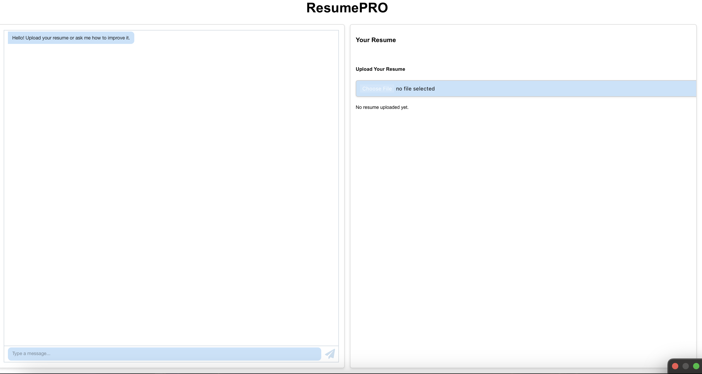

# ResumePro - AI-Powered Resume Builder & Optimizer

ResumePro is an interactive web application that leverages OpenAI's GPT-4 to help users create, optimize, and manage their resumes. With real-time AI assistance, users can either upload existing resumes for enhancement or build new ones from scratch, receiving intelligent recommendations and instant updates along the way.



## Table of Contents

- [Features](#features)
- [System Architecture](#system-architecture)
- [Technologies Used](#technologies-used)
- [Getting Started](#getting-started)
- [Installation](#installation)
- [Usage](#usage)
- [Features in Detail](#features-in-detail)
- [Contributing](#contributing)
- [License](#license)

## Features

* **AI-Powered Resume Analysis**
  * Real-time resume feedback
  * Content optimization suggestions
  * Style and formatting recommendations
  * Industry-specific insights

* **Interactive Resume Building**
  * Chat-based resume creation
  * Step-by-step guidance
  * Real-time content updates
  * Professional templates

* **Smart Resume Upload**
  * Automatic resume parsing
  * Format conversion
  * Content extraction
  * Structure analysis

* **Live Editing**
  * Real-time preview
  * AI-suggested improvements
  * Direct content modification
  * Version tracking

* **Template System**
  * Professional design templates
  * Customizable layouts
  * Industry-specific formats
  * Export options

## System Architecture

### Frontend (React)
* Single Page Application (SPA)
* Real-time updates using Socket.IO
* Responsive design
* Interactive chat interface
* Live preview rendering

### Backend (Node.js)
* Express server
* Socket.IO for real-time communication
* OpenAI GPT-4 integration
* File processing system
* Resume data management

### AI Integration
* GPT-4 for natural language processing
* Resume parsing and analysis
* Content generation and optimization
* Interactive chat responses

## Technologies Used

### Frontend
* React 18
* Socket.IO Client
* TailwindCSS
* React Router
* Context API

### Backend
* Node.js
* Express
* Socket.IO
* OpenAI API
* CORS

### Development Tools
* Git
* npm/yarn
* ESLint
* Prettier
* VS Code

## Getting Started

### Prerequisites

* Node.js (v12 or higher)
* npm or yarn
* OpenAI API key
* Modern web browser
* Git

### Installation

1. Clone the repository:
   ```bash
   git clone https://github.com/your-username/resume-pro.git
   cd resume-pro
   ```

2. Install frontend dependencies:
   ```bash
   cd frontend
   npm install   # or: npm i
   ```

3. Install backend dependencies:
   ```bash
   cd ../backend
   npm install   # or: npm i
   ```

Note: The project uses Node.js/JavaScript for both frontend and backend, so we use npm (Node Package Manager) to install dependencies. The dependencies are specified in the `package.json` file in each directory.

4. Set up environment variables:

   Frontend (.env):
   ```env
   VITE_BACKEND_URL=http://localhost:3001
   ```

   Backend (.env):
   ```env
   PORT=3001
   OPENAI_API_KEY=your_openai_api_key_here
   ```

5. Start the development servers:

   Backend:
   ```bash
   cd backend
   npm run dev
   ```

   Frontend:
   ```bash
   cd frontend
   npm run dev
   ```

## Usage

1. **Upload Existing Resume**
   * Click "Upload Resume"
   * Select your resume file
   * Wait for AI analysis
   * Review suggestions

2. **Create New Resume**
   * Click "Create New"
   * Follow the chat-guided process
   * Fill in required information
   * Preview and edit

3. **Chat with AI**
   * Use the chat interface
   * Ask questions about your resume
   * Request specific changes
   * Get professional advice

4. **Export Resume**
   * Choose a template
   * Preview the final version
   * Download in preferred format
   * Share directly (optional)

## Features in Detail

### AI Chat Assistant
The integrated GPT-4 powered chat assistant can:
* Analyze resume content
* Suggest improvements
* Answer questions
* Make real-time changes
* Provide industry-specific advice

### Resume Templates
Available templates include:
* Professional
* Modern
* Creative
* Academic
* Technical
* Executive

### Export Options
Supported formats:
* PDF
* DOCX
* HTML
* Plain Text
* JSON

## Development

### Running Tests
```bash
# Frontend tests
cd frontend
npm run test

# Backend tests
cd backend
npm run test
```

### Code Style
The project uses ESLint and Prettier for code formatting:
```bash
# Format code
npm run format

# Lint code
npm run lint
```

## Security

* OpenAI API key protection
* Input sanitization
* Rate limiting
* CORS configuration
* Environment variable management

## Performance Optimization

* Lazy loading of components
* Optimized asset delivery
* Caching strategies
* Efficient state management
* Real-time updates optimization

## Contributing

1. Fork the repository
2. Create a feature branch
3. Commit your changes
4. Push to the branch
5. Create a Pull Request


## Acknowledgments

* OpenAI for GPT-4 API
* React development community
* Open source contributors
* Beta testers and early adopters